# Hoja de trabajo #5
Simulador de procesos de una CPU

### Integrantes:
- Denil José Parada Cabrera - 24761
- Hugo Méndez - 241265
- Andrés Ismalej - 24005

## Gráfico 1 (Configuración normal intervalo 10)
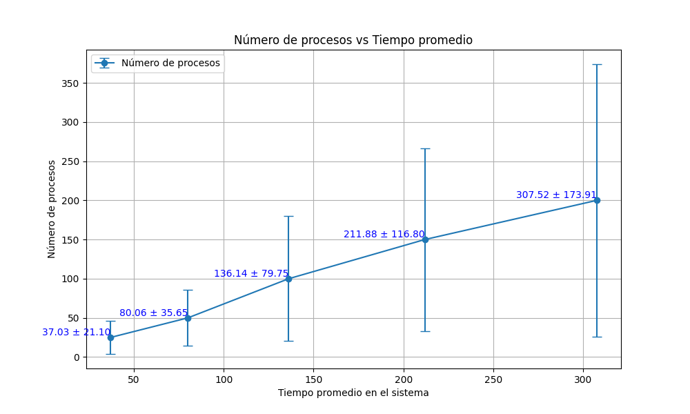

## Gráfico 2 (Configuración normal intervalo 5)
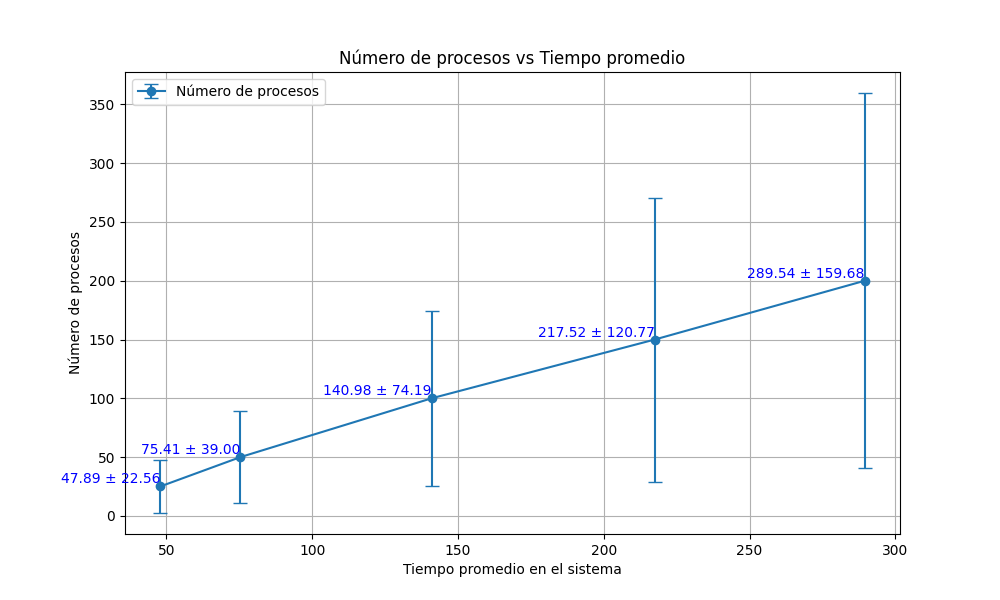

## Gráfico 3 (Configuración normal intervalo 1)
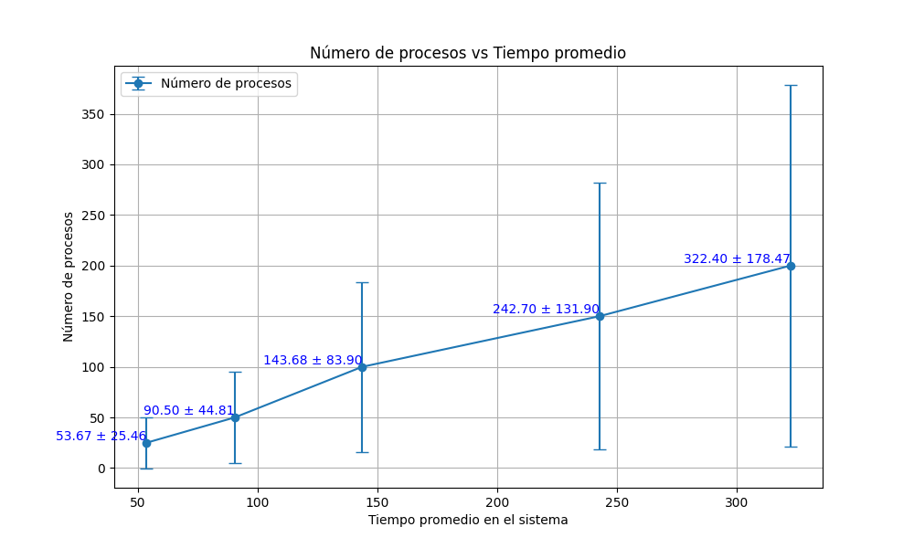

## Gráfico 4 (Configuración con 200 de RAM intervalo 10)
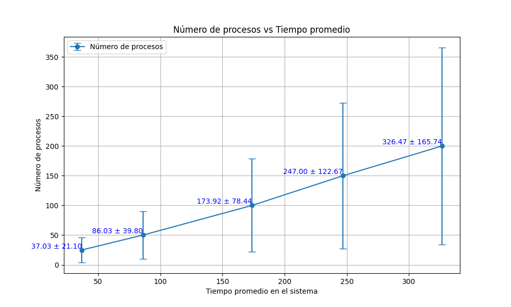

## Gráfico 5 (Configuración con 200 de RAM intervalo 5)
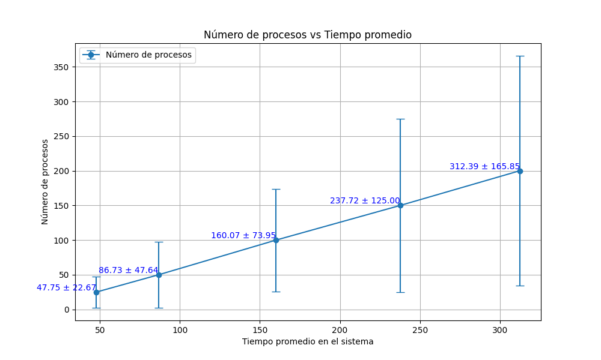

## Gráfico 6 (Configuración con 200 de RAM intervalo 1)
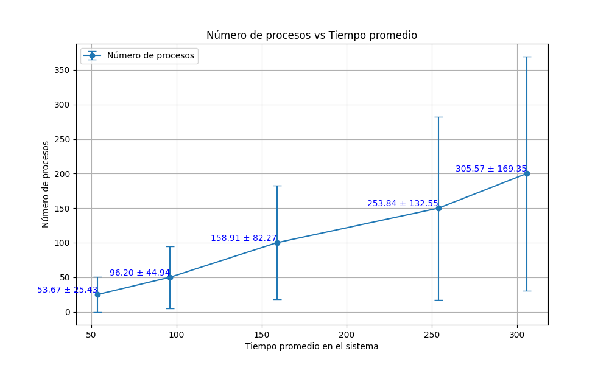

## Gráfico 7 (Configuración de CPU con velocidad de 6 intervalo 10)
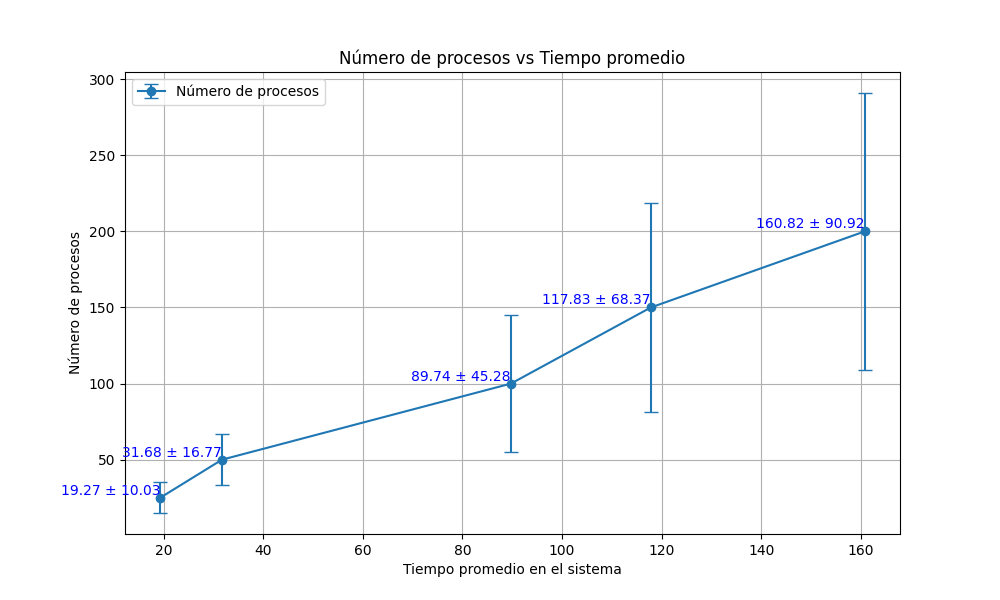

## Gráfico 8 (Configuración de CPU con velocidad de 6 intervalo 5)
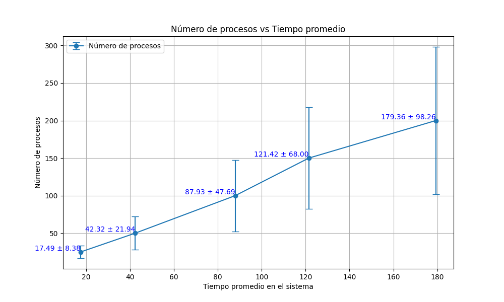

## Gráfico 9 (Configuración de CPU con velocidad de 6 intervalo 1)
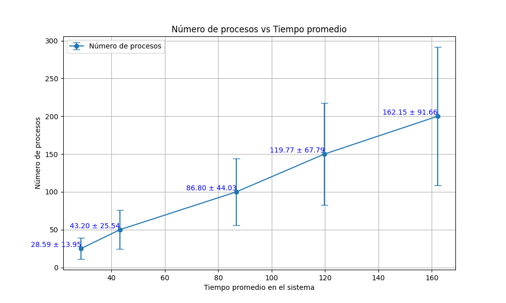

## Gráfico 10 (Configuración con 2 CPU'S intervalo 10)
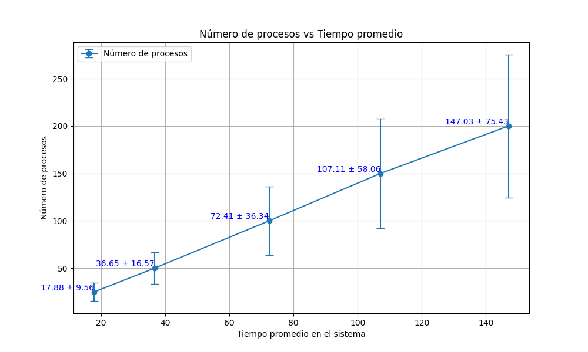

## Gráfico 11 (Configuración 2 CPU'S intervalo 5)
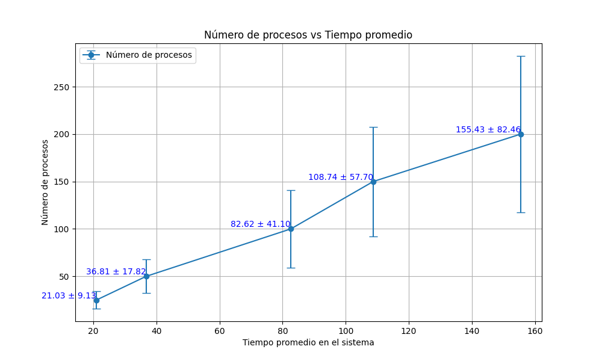

## Gráfico 12 (Configuración 2 CPU'S intervalo 1)
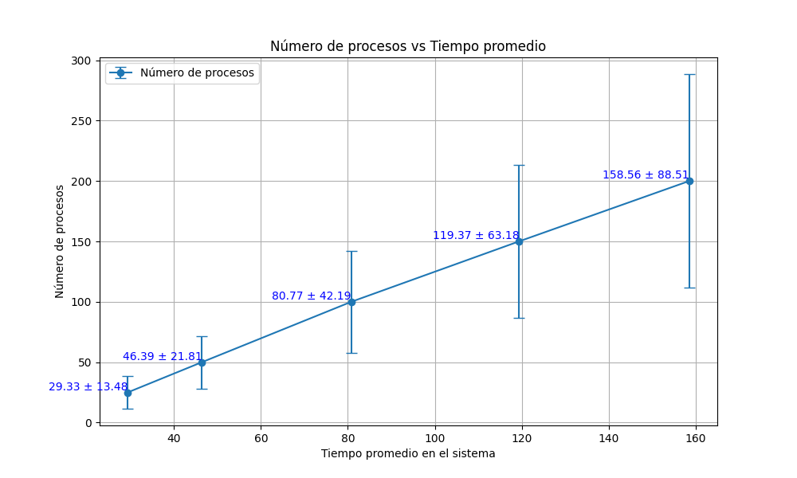

## ¿Cuál es la mejor estrategia?
Según los resultados, es más que claro que las 2 CPUs funcionan mucho mejor en simultáneo, ya que
el rendimiento al atender a varias tareas a la vez es mucho más eficiente que si solo se aumenta 
la velocidad de una CPU. Evitando así cualquier tipo de "cuello de botella" y no demorando tanto en
atender a todos los procesos. De igual manera, fue mucho más rápida cuando los procesos llegaban en 
intervalos de 10 unidades. 
En comparativa con los datos, aunque la variabilidad de los mismo es bastante alta con porcentajes de 
53.5%, 45.2%, 50.2%, 54.2% y 51.3% con respecto a los tiempos, supera en gran medida a cualquier
otra configuración. 
